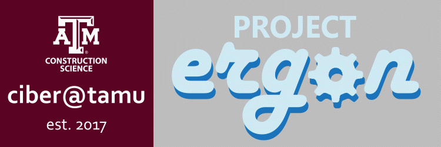
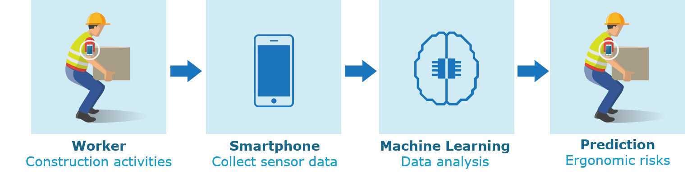

# **PROJECT ERGON**

Project Ergon aims at minimizing ergonomic risks of construction worker using smartphone and machine learning models.

## **What is ergonomics?**

- Ergonomics means the science of **designing a job to fit the workers’ physical capabilities**, rather than imposing the job on workers’ body.

## **What is musculoskeletal disorders (MSDs)?**

- MSDs are a group of disorders or **injuries in a person's inner body parts** (e.g. muscles, nerves, tendons, joints, cartilages, and spinal discs).
- Construction jobs are among the most **ergonomically hazardous** occupations which involve activities such as manual handling, heavy lifting, body twisting, and frequently working in awkward positions, all being potential causes of MSDs.

## **What does project Ergon deal with?**

### **1. Awkward posture**

If a person is not in his/her natural posture. Performing activity in an awkward posture repetitively and/or for a long time can cause MSDs.

**Demo:** ([Watch the full video](https://youtu.be/2bdmS0U2x-Q))

**Go to the '[awkward-posture](/awkward-posture)' folder for more details.**

### **2. Overexertion**

If a person applies too much force to perform an activty. Performing overexerted activity for a long time and/or very frequently can cause MSDs.

**Demo:** ([Watch the full video](https://youtu.be/aiErxG5mV3c))

**Go to the '[overexertion](/overexertion)' folder for more details.**

## **Publications related to Project Ergon**

**Note: Please cite the articles if you find these useful in your research.**

- Nath, N. D., Akhavian, R., & Behzadan, A. H. (2017). ***Ergonomic analysis of construction worker's body postures using wearable mobile sensors.*** Applied ergonomics, 62, 107-117. ([Read from here](http://people.tamu.edu/~abehzadan/documents/Nath&Akhavian&Behzadan.AE.2017.pdf))

- Nath, N. D., Chaspari, T., & Behzadan, A. H. (2018). ***Automated ergonomic risk monitoring using body-mounted sensors and machine learning.*** Advanced Engineering Informatics, 38, 514-526. ([Read from here](http://people.tamu.edu/~abehzadan/documents/Nath&Chaspari&Behzadan.AEI.2018.pdf))

- Nath, N. D., & Behzadan, A. H. (2017). ***Construction productivity and ergonomic assessment using mobile sensors and machine learning.*** In Computing in Civil Engineering 2017 (pp. 434-441). ([Read from here](http://people.tamu.edu/~abehzadan/documents/Nath&Behzadan.IWCCE.2017.pdf))

- Nath, N. D. (2017). ***Construction ergonomic risk and productivity assessment using mobile technology and machine learning.*** Technology and Construction Management, Missouri State University, Springfield, MO. ([Read from here](https://bearworks.missouristate.edu/cgi/viewcontent.cgi?article=4167&context=theses))
